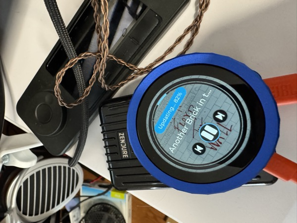

# HiPhi ESP Firmware

[](https://github.com/muness/roon-knob/actions/workflows/docker.yml)
[](https://github.com/muness/roon-knob/releases/latest)
[](https://github.com/muness/roon-knob/releases)

**HiPhi by Open Horizon Labs** — [hiphi.audio](https://hiphi.audio/) · [Flash firmware](https://firmware.hiphi.audio/)

Dedicated hi-fi controllers built from commodity ESP32 hardware. A HiPhi controller sits on your desk, your couch, or your wall and does one thing well: show what is playing and let you change it — transport, volume, zones — without opening a phone or a laptop. This repository holds the firmware for the whole family. Each target is a different piece of hardware running the same shared control core, talking to the same bridge, [Unified Hi-Fi Control](https://github.com/open-horizon-labs/unified-hifi-control), which connects to Roon, Lyrion Music Server (LMS), and OpenHome/UPnP renderers.

[](https://photos.app.goo.gl/s5LpWqBTaXRihmjh7)
*Click to watch a video demo of the HiPhi Dial*

> **Firmware maturity:** the current v2.7 prerelease is **Alpha** across every
> target because its exact artifacts still need physical regression testing.
> HiPhi Frame builds are available for early testing,
> but its current shared-stack firmware has not completed equivalent hardware
> regression coverage.

## The Family

| Controller | Hardware | Flash |
|---|---|---|
| **HiPhi Dial** | [Waveshare ESP32-S3-Knob-Touch-LCD-1.8](https://www.waveshare.com/esp32-s3-knob-touch-lcd-1.8.htm) | [Flash Dial](https://firmware.hiphi.audio/stable/?target=dial) |
| Dial auxiliary parking image | Waveshare knob, second ESP32 | [Flash auxiliary](https://firmware.hiphi.audio/stable/?target=knobaux) |
| **HiPhi Frame** | Waveshare ESP32-S3-PhotoPainter | [Flash Frame](https://firmware.hiphi.audio/stable/?target=frame) |
| **HiPhi Slate** | Waveshare ESP32-S3-RLCD-4.2 | [Flash Slate](https://firmware.hiphi.audio/stable/?target=rlcd) |
| **HiPhi Joy** | M5Stack AtomS3 JoyStick K137 | [Flash Joy](https://firmware.hiphi.audio/stable/?target=joy) |
| **HiPhi Tough** | M5Stack Tough K034 | [Flash Tough](https://firmware.hiphi.audio/stable/?target=tough) |
| **HiPhi Dial Lab** | M5Stack Dial K130-V11 | [Flash Dial Lab](https://firmware.hiphi.audio/beta/?target=m5dial) |
| **HiPhi Twist** | M5StickS3 K150 | [Flash Twist](https://firmware.hiphi.audio/beta/?target=sticks3) |
| **HiPhi Remote** | M5Stack StopWatch C152 | [Flash Remote](https://firmware.hiphi.audio/beta/?target=stopwatch) |
| **Kizz** | M5StackChan K151 | [Flash Kizz](https://firmware.hiphi.audio/beta/?target=stackchan) |

Pick a channel — Stable, Beta, or Alpha — from the [firmware channel chooser](https://firmware.hiphi.audio/). Flashing needs a current desktop version of Chrome, Edge, or Firefox; iPhone, iPad, and Android cannot flash over USB.

## What You Need

1. **Hardware**: one of the boards above. The Dial (~$50) is the flagship — buy it at [amazon](https://amzn.to/4pYZdiC) to support my work.
2. **Music source**: Roon Core, Lyrion Music Server, or an OpenHome renderer on your network.
3. **Docker host** (NAS, Raspberry Pi, always-on computer) to run the bridge.

> **New to this?** See the [Getting Started from Scratch](docs/usage/GETTING_STARTED.md) guide.

## Run the Bridge

Every HiPhi controller talks to the same bridge, Unified Hi-Fi Control. Set it up once and every controller on your network can use it.

**Docker (recommended)**

On any Docker host (NAS, Raspberry Pi, etc.):

```yaml
# docker-compose.yml
services:
  unified-hifi-control:
    image: muness/unified-hifi-control:latest
    restart: unless-stopped
    network_mode: host
    volumes:
      - unified-hifi-control-data:/data

volumes:
  unified-hifi-control-data:
```

```bash
docker compose up -d
```

> **Note:** The legacy image name `muness/roon-extension-knob` still works and receives the same updates.

**Already have the [Roon Extension Manager](https://github.com/TheAppgineer/roon-extension-manager)?**

Find "Unified Hi-Fi Control" in the extension list and install it from there (Roon-only mode).

**Roon users:** go to **Roon → Settings → Extensions** and enable **"Unified Hi-Fi Control"**.

Controllers find the bridge automatically over mDNS. Each controller remembers the selected bridge's name and resolves its current address when reconnecting, so an IP change does not normally require editing settings. See [connection recovery](docs/connection-recovery.md) for the status vocabulary and recovery behavior.

## Per-target Guides

- **HiPhi Dial** — [quick start, controls, and troubleshooting](docs/usage/DIAL.md)
- **HiPhi Tough** — [build, flash, and controls](docs/dial/M5STACK.md)
- **Frame, Slate, Joy, and the M5 betas** — [target notes index](docs/targets/README.md)
- **All targets** — [firmware flashing](docs/usage/FIRMWARE_FLASHING.md), [Wi-Fi provisioning](docs/usage/WIFI_PROVISIONING.md), [OTA updates](docs/usage/OTA_UPDATES.md)

## Features

- Real-time now playing with album artwork on targets whose displays support it
- Velocity-sensitive volume control on encoder targets
- Multi-zone support across Roon, LMS, and OpenHome
- Automatic display dimming and sleep
- Over-the-air firmware updates on the stable channel
- Wi-Fi setup via captive portal

## Development

See [DEVELOPMENT.md](docs/dev/DEVELOPMENT.md) for building firmware, running the PC simulator, and contributing. Agent-facing context lives in [AGENTS.md](AGENTS.md).

## Roadmap

See [PROJECT_AIMS.md](docs/meta/PROJECT_AIMS.md) for project goals and decision framework, and [ROADMAP_IDEAS.md](docs/meta/ROADMAP_IDEAS.md) for user feedback and planned improvements.

## Support

Questions or issues? [Open an issue](https://github.com/muness/roon-knob/issues), join the [Roon Community discussion](https://community.roonlabs.com/t/50-diy-roon-desk-controller/311363), visit [hiphi.audio](https://hiphi.audio/), or [buy me a coffee](https://www.buymeacoffee.com/muness).

## License

The firmware is **free for individuals to use on their own systems**, and it is **noncommercial only**. It is released under the [PolyForm Noncommercial License 1.0.0](LICENSE).

You can build it, flash it, modify it, and run it on your own gear at home for free.

If you are an **installer, integrator, or dealer**, or you are **deploying it for clients**, **bundling it with hardware you sell**, or making it part of a **paid, hosted, or managed service**, you need a commercial license. See [COMMERCIAL-LICENSE.md](COMMERCIAL-LICENSE.md).

Versions up to and including v2.2.2 were released under the [MIT License](LICENSE-MIT).

## Acknowledgments

Thanks to **gTunes** from the Roon community for alpha testing, detailed feedback, and help with the velocity-sensitive volume control implementation.
